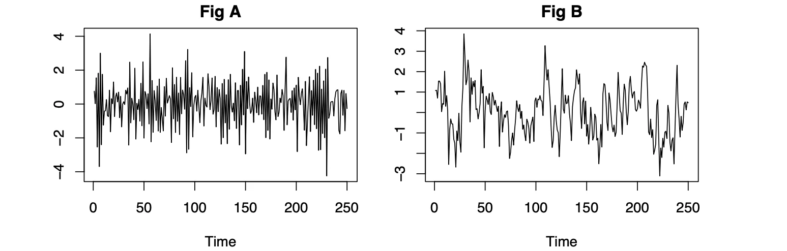
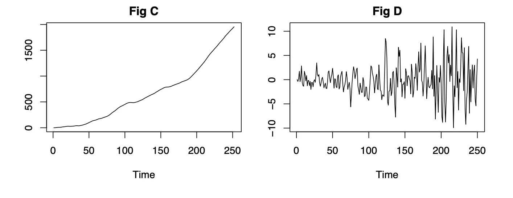
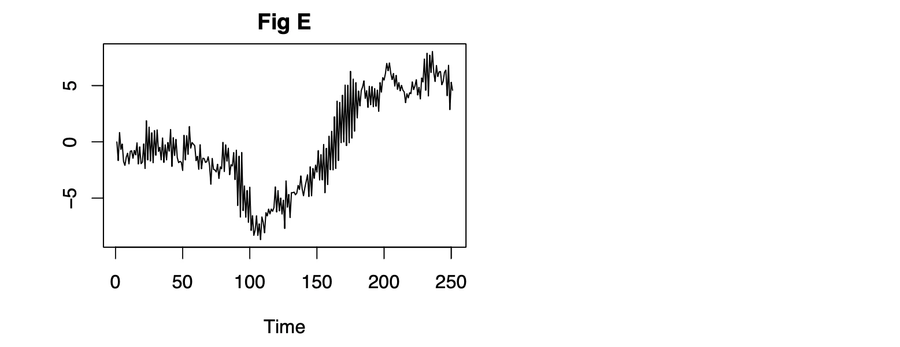
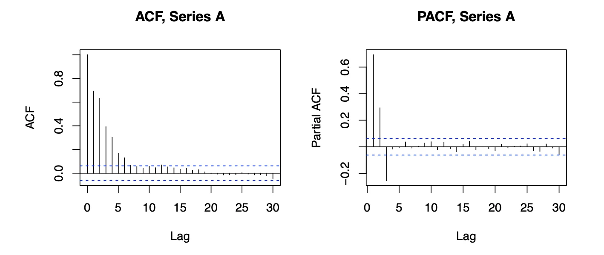
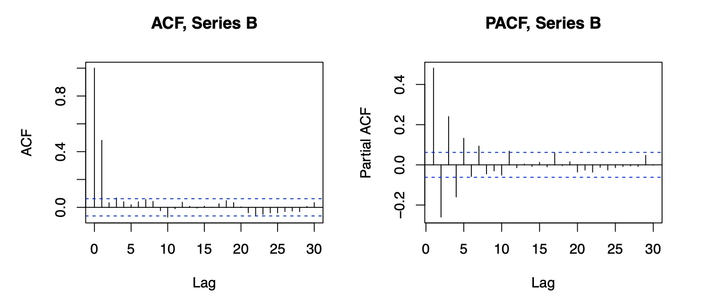
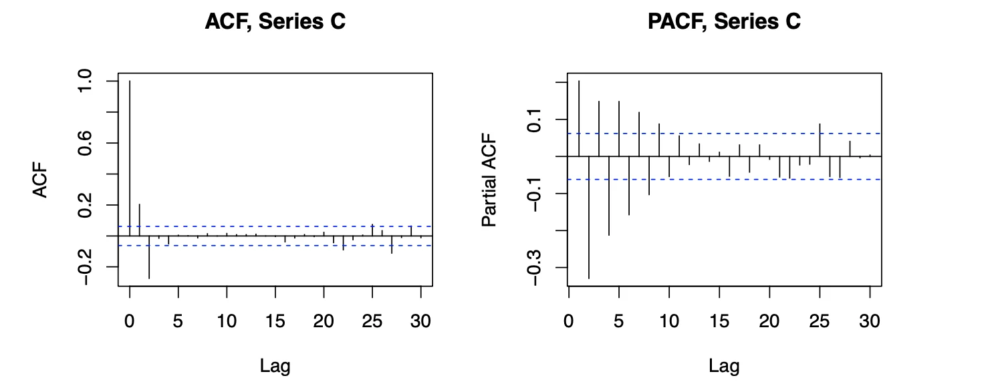
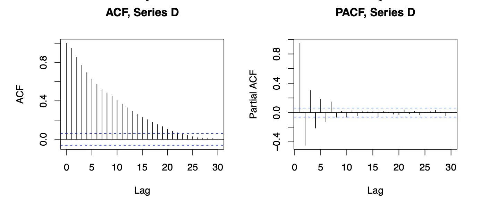
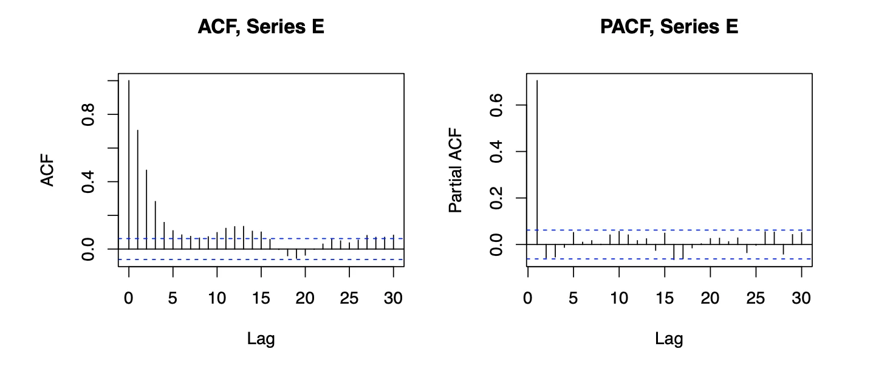

```{r setup, include=FALSE}
knitr::opts_chunk$set(echo = TRUE)
```

## B. Time series modelling

\begin{enumerate}

\item The figure labelled A to E show five series whose defining equations are given bellow. 

\begin{enumerate}

\item[i)] $X_t-2X_{t-1}+X_{t-2}=\epsilon_t -0.4\epsilon_{t-1}$

\item[ii)] $X_t=\epsilon_t +0.02t\epsilon_{t-1}$

\item[iii)] $X_t=0.65X_{t-1}+\epsilon_t $

\item[iv)] $X_t=-0.65X_{t-1}+\epsilon_t $

\item[v)] $X_t=0.1X_{t-1}+0.9X_{t-2}+\epsilon_t$
\end{enumerate}

State, with reasons, which equations corresponds to which plot.


```{r,echo=F,out.width="50%", fig.cap=NULL,fig.align="center"}

```

```{r,echo=F,out.width="50%", fig.cap=NULL,fig.align="center"}

```

```{r,echo=F,out.width="50%", fig.cap=NULL,fig.align="center"}

```


\item Suggest appropiate ARMA models for the five (A,B,C,D,E) bellow, giving reasons for you choice in each case.

```{r,echo=F,out.width="50%", fig.cap=NULL,fig.align="center"}

```

```{r,echo=F,out.width="50%", fig.cap=NULL,fig.align="center"}

```

```{r,echo=F,out.width="50%", fig.cap=NULL,fig.align="center"}

```
```{r,echo=F,out.width="50%", fig.cap=NULL,fig.align="center"}

```
```{r,echo=F,out.width="50%", fig.cap=NULL,fig.align="center"}

```


\item The data for this assignment ara measured strength of the overturning in the Nort Atlantic from mooring at 26N between April 2014 and  March 2014, found in the file \verb|overturning.csv|  


\begin{enumerate}


\item Average the data in quarterly means. Produce numerical and graphical summaries of average data, and comment on your findings and highligth any potential outliers. You might find it useful to covert the averaged data to a time series 


\item Fit ARMA and an ARIMA model to the data. Choose the most appropiate model, and use this to predict the values for six 3-month periods from april 2014 to September 2015.

\item Fit DLM to the data (including both a trend and seasonal component), Use your model to predict the values for April 2014 to September 2015.

\item Compare results of parts b and c, and comment on any differences you may find.

\end{enumerate}

\end{enumerate}

Load data

```{r}
dat<-read.csv("overturning.csv")
```


a)

We create quarterly time series 

```{r}
quarterly<-aggregate(dat[,"Overturning_Strength"],by=list(dat$Quarter,dat$year),FUN=mean)
quarterly_ts = ts(quarterly$x, start = c(2004, 2), frequency = 4)
```

the numerical summary 

```{r}
summary(quarterly_ts)
```
plot the the time series

```{r}
plot(quarterly_ts) 
```

we can see the value 8.89 is an outlier  reached in the first quarter 2010.


b) 

```{r}
par(mfrow=c(1,2))
acf(quarterly_ts)
pacf(quarterly_ts)
```

```{r}
mod<-auto.arima(quarterly_ts,d=0)
```
```{r}
pred<-forecast::forecast(mod,h=4)
```


c) 


```{r}
library(fpp)
library(forecast)
library(dlm)


buildGap<- function(u){
  trend <- dlmModPoly(dV = u[8], dW= exp(u[1:2]), m0=c(u[6], u[7]), C0=2*diag(2))
  seas  <- dlmModSeas(4,dV=exp(u[9]))
  gap   <- dlmModARMA(ar=u[4],ma=u[5],sigma2=exp(u[3]))
  
  return<- (trend+gap+seas)
}

init<-c(-3,-1,-3,.4,.4,.4,.4,0.4,0.4)
outMLE<-dlmMLE(quarterly_ts, init, buildGap)
outMLE$value
dlmGap<-buildGap(outMLE$par)

model_filter <- dlmFilter(quarterly_ts, dlmGap)

fore <- dlmForecast(dlmGap, nAhead =4 ,sampleNew=1)
fore <- dlmForecast(model_filter, nAhead =4 ,sampleNew=1)

```


